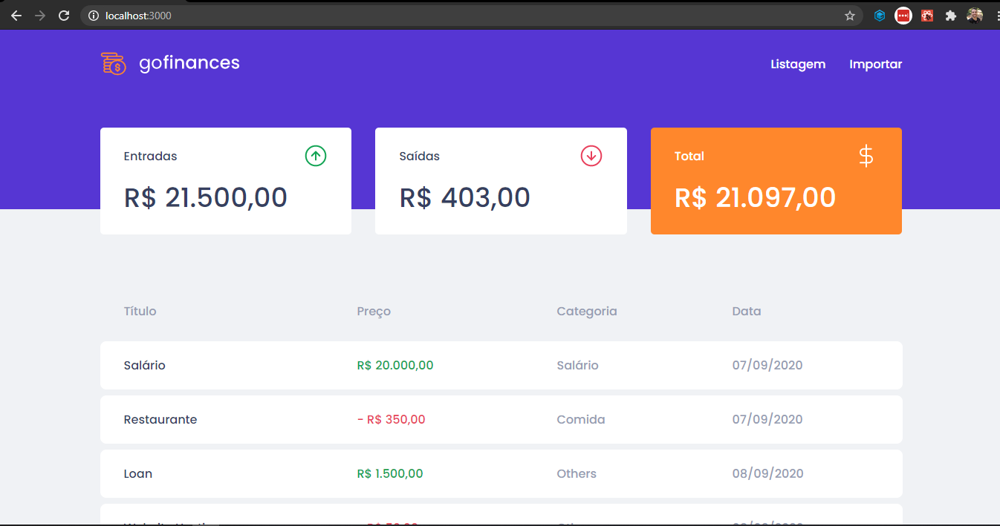
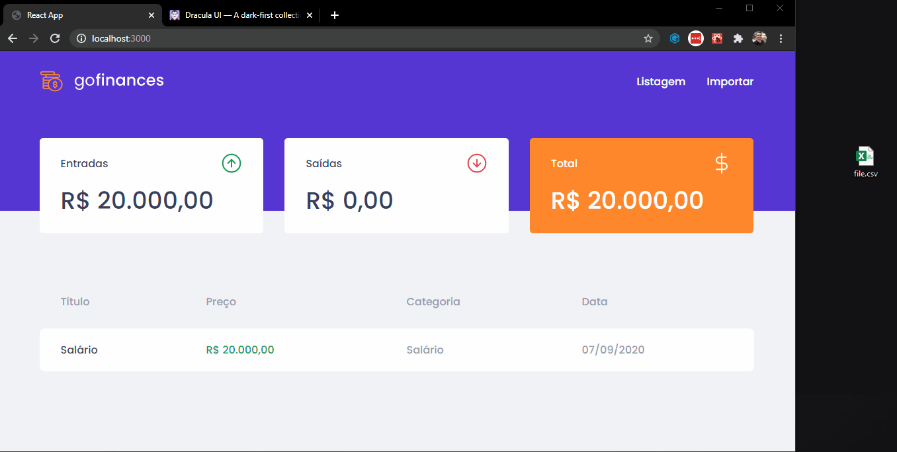

# Challenge 07 - GoFinance with React JS

<h2>
:computer: Preview
</h2>




<br/>
GoFinance is a web application created in challenge 7 of the GoStack bootcamp to monitor incoming and outgoing financial transactions. <br>
The application displays the transactions stored in the database and also allows uploading a file in CSV format, containing information such as title, type, value and category of the transaction.<br/><br/>

# How to install and configure

## Ruuning frontend
After to clone repository, run the commands below:

`cd gostack-challenge-gofinancesweb`

To install all dependencies:
```sh
yarn
```
To run frontend:
```sh
yarn start
```

## Running server

Clone the backend repository by accessing [gostack-challenge-typeorm-upload](https://github.com/cesarramos95/gostack-challenge-typeorm-upload).

`cd gostack-challenge-typeorm-upload`

To install all dependencies:
```sh
yarn
```
To run the backend:
```sh
yarn dev:server
```

## File upload
Use the **file.csv** file in the assets folder to test the file upload.

<br/>
<footer>

Made with :heart: by [César](https://www.linkedin.com/in/cesararamos/)
</footer>

